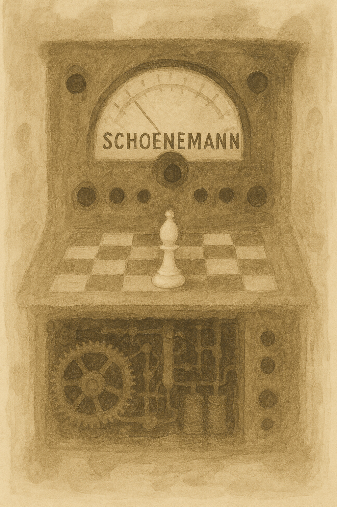

---

# Schönemann  
<p align="center">
  <br>
  <em>A simple yet powerful chess engine written in C++.</em>
</p>

---

## Table of Contents  
- [About](#about)  
- [How It Works](#how-it-works)  
- [Build Instructions](#build-instructions)  
- [Performance Rating](#performance-rating)  
- [Acknowledgments](#acknowledgments)  

---

## About  
**Schönemann** is a chess engine inspired by this fascinating line in the Ruy López:  
```
1. e4 e5 2. Nf3 Nc6 3. Bb5 f5 4. d4 fxe4 5. Nxe5 Nxe5 6. dxe5 c6 7. Nc3 *
```  
At first glance, it may appear that White is hanging a bishop, but they are not at a disadvantage.  

---

## How It Works  
Schönemann implemts this features (and some more that if forgot to include here):  
- **NNUE** with 1024 hidden layers, trained using **Monty** data (Currently doing selfgen in the background)
- **Principal Variation Search (PVS)**  
- **SEE Pruning** 
- **Check Extensions**
- **MVA–LVV**
- **Quiet History**
- **Null Move Prunning (NMP)**
- **RFP**
- **Simple Probcut**
- **(and many others)**

---

## Build Instructions  
To compile Schönemann, simply run:  
```bash  
make all  
```  
This will produce an executable named `null` (depending on your OS).  

---

## Performance Rating  
Schönemann is rated approximately **3329 Elo** (45/15) on the CCRL.  

Lichess performance:  
- **[Bullet](https://lichess.org/@/Schoenemann/perf/bullet):**  
    
- **[Blitz](https://lichess.org/@/Schoenemann/perf/blitz):**  
    
- **[Rapid](https://lichess.org/@/Schoenemann/perf/rapid):**  
    

---

## Acknowledgments  
Special thanks to: 

- Disservin for his [chess library](https://github.com/Disservin/chess-library/), which significantly speed up development.  
- Fury for granting access to his OB instance.  
- And all other Furybench members.
- Logo was generated using ChatGPT

--- 
